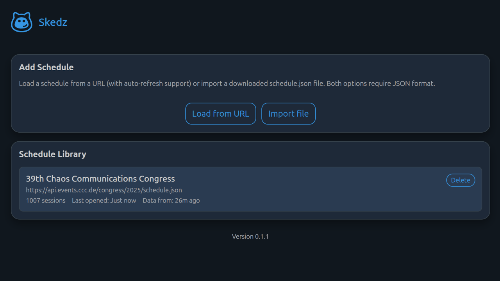

# Skedz

Skedz is an offline-first Progressive Web App (PWA) for viewing, filtering and personalizing conference schedules.

It was created during the [39C3 congress](https://events.ccc.de/congress/2025/) as an open source experiment to explore whether a fully client-side, self-managed schedule app can work reliably without any backend server.

Skedz is inspired by [Calendify](https://calendify.com/) schedules, but runs completely locally on the user’s device.



## Supported Formats

| Format | Extensions | Description |
|--------|------------|-------------|
| **JSON (schedule.json)** | `.json` | JSON format used by Frab, Pretalx, and others |
| **XML (schedule.xml)** | `.xml` | XML format used by Frab, Pretalx, Pentabarf, and others |
| **XCal** | `.xcal`, `.xcs` | XML-based iCalendar format |
| **iCal** | `.ical`, `.ics` | Standard iCalendar format |


## Getting started

### Option A: Use the hosted version

- PWA: https://app.skedz.org
- Project website: https://skedz.org

### Option B: Run locally

If not available yet, install [Node.js](https://nodejs.org/) (LTS version recommended), [npm](https://www.npmjs.com/get-npm), and [git](https://git-scm.com/). 
For example, on Debian/Ubuntu:

```bash
sudo apt update
sudo apt install nodejs npm git
```

Then clone the repository:

```bash
git clone https://github.com/ysorge/skedz.git
cd skedz
npm install
```

### Development mode

Start a local development server with hot reload:

```bash
npm run dev
```

Open the URL shown by Vite (usually http://localhost:5173).

#### Production build (PWA)

Build the production version including service worker support:

```bash
npm run build
npm run preview
```

Then open the preview URL (typically http://localhost:4173).  
You can install the app from the browser menu ("Install app").

Note: Opening the built files directly via `file://` will not work correctly because service workers require HTTP.


## App features

### Core functionality

- Load frab-compatible `schedule.json` endpoints (e.g. congress Fahrplan)
- Platform-independent PWA (mobile & desktop)
- Offline-first: schedules and personal choices are stored locally
- Grouped-by-day session list ordered by time

### Filtering and views

- Filters: track, day, room, type, language, search term
- Timezone handling: view schedule in event timezone or convert to device timezone
- Multiple view modes: compact table, detailed list

### Personal schedule

- Like sessions to build your own schedule
- Session detail screens with full description
- Local notifications for liked sessions (local reminders)
- Export of liked sessions (iCal/JSON/CSV)


## Offline-first behavior

The app shell is cached by the service worker. Schedules are stored in an IndexedDB after loading from URL or importing a file. On next launch (even offline), the cached schedule loads instantly.

Some schedule endpoints/servers block browsers via CORS. If loading of schedules from URL fails with a network/CORS error, the JSON file must be downloaded outside the app and then imported manually via "Import file".


## Project status

Skedz is a community-driven, open source side project.
The focus is robustness, offline usability and transparency — not feature parity with native apps.
Contributions, feedback and issues are very welcome.

### Contributing

Pull requests are welcome! Please open an issue first to discuss what you would like to change. 

### License

GNU Affero General Public License v3.0 (AGPL-3.0).
See [LICENSE](LICENSE) for details.

### Author

Skedz was created by Yves Sorge during 39C3.
